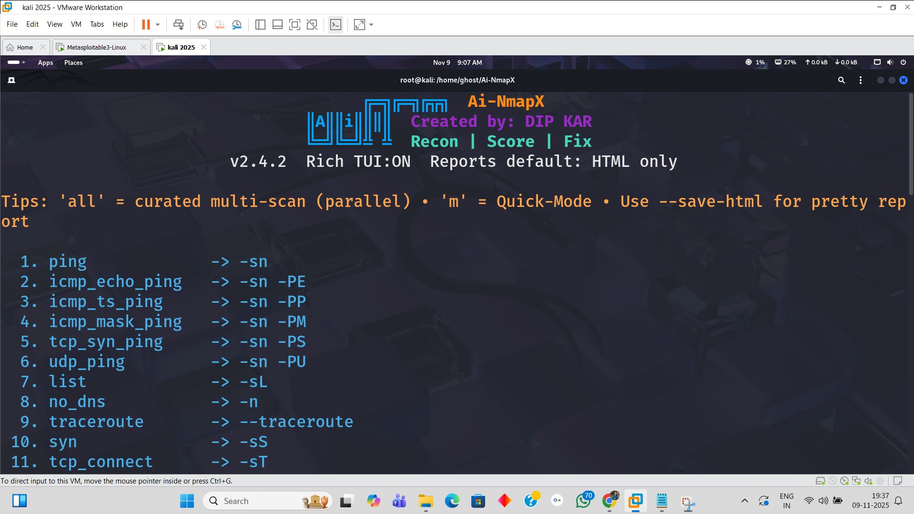
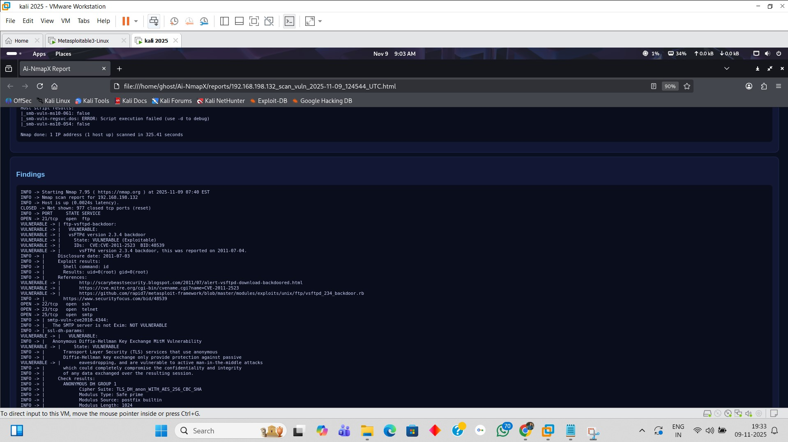
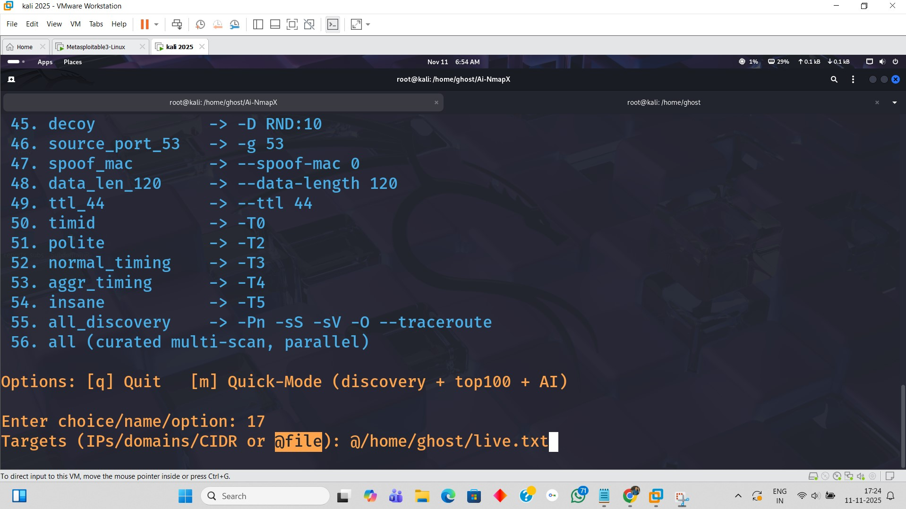
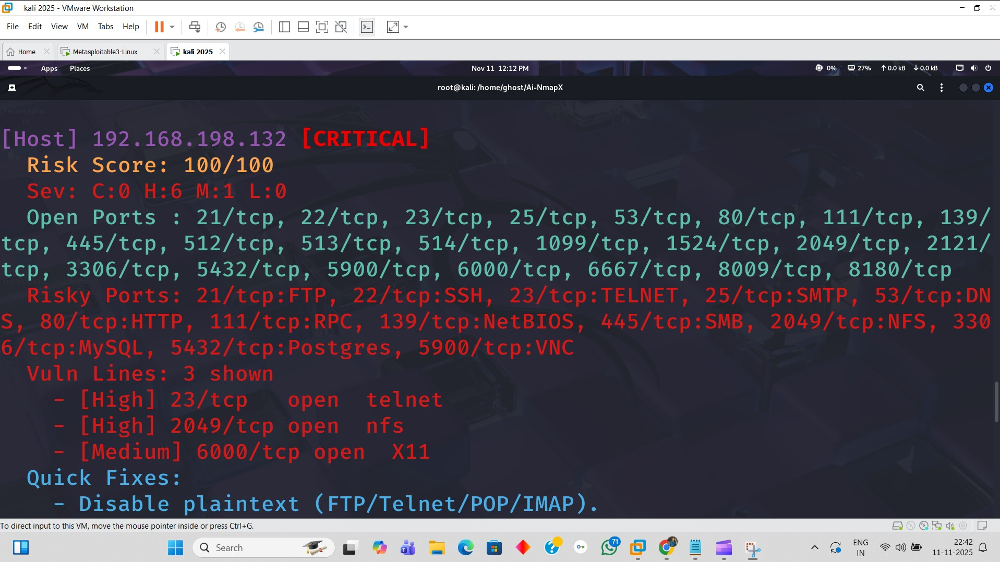
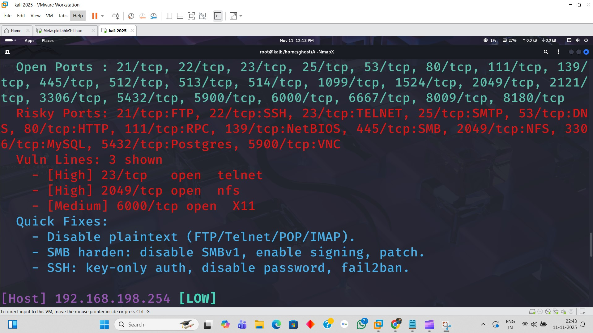
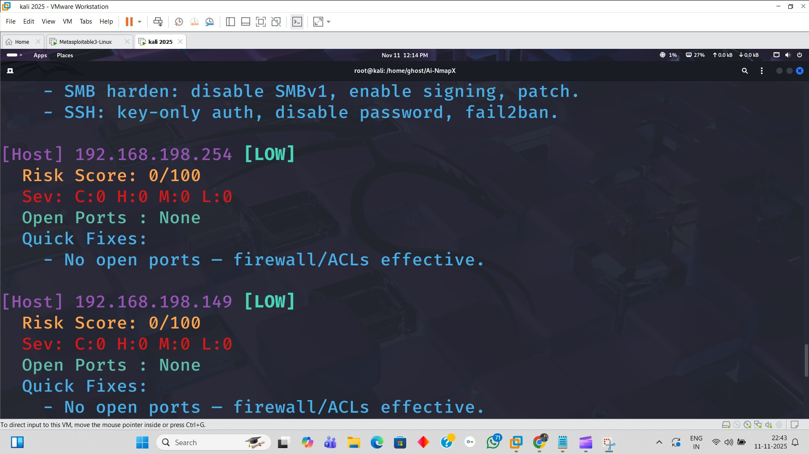
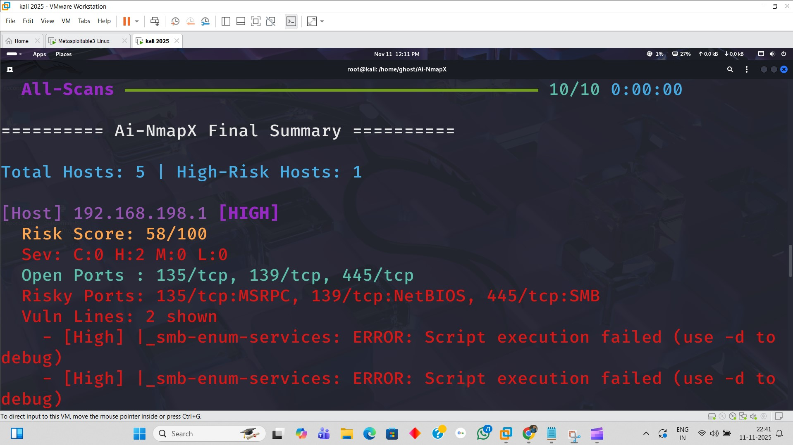

# Ai-NmapX — Parallel Nmap wrapper with AI-assisted analysis & clean HTML reports 🚀

### Quick Start
Run directly:
```bash
python3 AI-NmapX.py
```
(Windows: `py -3 AI-NmapX.py`)

## LEGAL NOTICE / USAGE POLICY
Use only on systems you own or have explicit written permission to test.
Unauthorized scanning may be illegal. The authors/contributors are not
responsible for misuse, damage, or legal consequences. For permission or
clarifications, open an issue on the repository.


**Version:** v2.4.2  
**Author:** Dip Kar (HackerBlazeX)  
**License:** MIT

---

## TL;DR ✨
**No need to memorize commands!** Open the **interactive menu** and **just choose options** — Ai-NmapX handles everything end-to-end and gives you a **final polished HTML report** automatically. Chill. ☕  
For power users, rich CLI flags are available — but the menu already covers 99% use-cases.

---

## How it saves your time ⏱️
- 🧭 **Zero memorization:** Presets + menu choices replace long Nmap flags.  
- 🧵 **Parallel scans (1–50 workers):** multi-host jobs finish faster.  
- 🤖 **AI-assisted triage:** automates CVE picking, severity, risky ports, quick fixes — **minutes → seconds**.  
- 🗂️ **HTML by default:** shareable, sorted by risk; no manual formatting.  
- 🔒 **Secure exec + whitelisted extras:** runs right the first time (fewer retries).  
- 🧪 **Quick mode:** discovery → top-ports → AI summary in one go.

---

## What it scans / Capabilities 🔍
Ai-NmapX wraps Nmap with a clean workflow and adds smart analysis:

**Host discovery & mapping**  
- ICMP echo/timestamp/mask, TCP SYN ping, UDP ping, traceroute, list-only, no-DNS.

**TCP stealth & techniques**  
- SYN (half-open), connect, ACK, window, Maimon, NULL, FIN, XMAS.

**UDP / SCTP / IP-protocol**  
- UDP services, SCTP INIT/COOKIE-ECHO, IP protocol discovery.

**Service/OS detection**  
- `-sV`, default NSE scripts, OS detect, aggressive combo (`-A`) as needed.

**Port coverage & speed**  
- Fast (`-F`), Top-100/1000 (with versioning), **Full 0–65535**.

**NSE bundles (focused enumeration)**  
- Safe, discovery, auth, brute (scope!), malware, firewall, **vuln**, http/dns/ftp/smb/snmp/ssl-heartbleed etc.

**Web posture (security hygiene)**  
- TLS versions (1.0/1.1/1.2/1.3), **weak cipher hints**, HSTS + security headers, certificate expiry parsing.

**AI Summary (auto-triage)**  
- CVE extraction, **severity (Low→Critical)**, risky ports/services, **Quick Fixes** (e.g., disable SMBv1, enforce HTTPS/HSTS, SSH key-only), and **Next Steps** (focused NSE, OWASP checks).

**Reporting**
- **HTML (dark, neat) by default**, optional JSON/TXT; hosts sorted by risk; chips for TLS/HSTS; per-target reports.

**Safety**
- **No `shell=True`**, **sanitized `--extra`** (invalid flags auto-drop), `--dry-run` preview, **DNS wildcard guard**.

---

## Installation Process

Clone the repo:
```bash
git clone https://github.com/HackerBlazeX/Ai-NmapX.git
cd Ai-NmapX
```

Run:
```bash
python3 AI-NmapX.py
```

## Demo & Screenshots

> Click any link to open the unlisted demo video on Google Drive.

- **Now_AiNmapX_Also_Offline:** https://drive.google.com/file/d/1PWfMjTIC3Tw_HLiRACPU0rHuref-5DOo/view?usp=sharing


**Demo videos (Google Drive - unlisted)**

- **Auto-fix demo:** https://drive.google.com/file/d/17Oa9SwgRrIUZm78c7M75GqiSXElI-T10/view?usp=sharing  
- **IP list / Multi-target demo:** https://drive.google.com/file/d/1QMApWv9KAe1LCQSf6-WtAqKPTWzlo5oI/view?usp=sharing  
- **Installation guide:** https://drive.google.com/file/d/1WV9ROJkR7G5to8Q6PNUSRyjgDsymcL5x/view?usp=sharing  

> Click any link to open the unlisted demo video on Google Drive.

---

### Quick screenshots (click to enlarge)

<div align="center">

<figure>
  <a href="assets/screenshots/demo-1.jpg"></a>
  <figcaption><strong>Interface — Main TUI / Dashboard</strong><br><small>Shows interactive menu, presets, and worker options.</small></figcaption>
</figure>

&nbsp; &nbsp;

<figure>
  <a href="assets/screenshots/demo-2.jpg"></a>
  <figcaption><strong>Vulnerability View — Per-host findings</strong><br><small>Shows vulnerabilities, CVE highlights and quick info.</small></figcaption>
</figure>

<br>

<figure>
  <a href="assets/screenshots/demo-3.jpg"></a>
  <figcaption><strong>Scan Results — Detailed output</strong><br><small>Service/version details and port state summary.</small></figcaption>
</figure>

&nbsp; &nbsp;

<figure>
  <a href="assets/screenshots/demo-8.jpg"></a>
  <figcaption><strong>Scan IP List Demo — Multi-target input</strong><br><small>How to provide an IP list and run parallel scans.</small></figcaption>
</figure>

<br>

<figure>
  <a href="assets/screenshots/demo-4.jpg"></a>
  <figcaption><strong>Quick Fix Idea — 1</strong><br><small>AI suggested fix / remediation snippet.</small></figcaption>
</figure>

<figure>
  <a href="assets/screenshots/demo-5.jpg"></a>
  <figcaption><strong>Quick Fix Idea — 2</strong><br><small>Suggested commands and next steps.</small></figcaption>
</figure>

<figure>
  <a href="assets/screenshots/demo-6.jpg"></a>
  <figcaption><strong>Quick Fix Idea — 3</strong><br><small>Patch / config change example.</small></figcaption>
</figure>

<figure>
  <a href="assets/screenshots/demo-7.jpg"></a>
  <figcaption><strong>Quick Fix Idea — 4</strong><br><small>Final recommendations & next steps.</small></figcaption>
</figure>

</div>

---

> **Note:** Videos are unlisted on Google Drive. Images live in `assets/screenshots/`.


## “No Commands Needed” Mode 😎
- Launch \`ai-nmapx -i\`  
- **Pick from 55+ presets & combos** (discovery, stealth, UDP/SCTP/IP, NSE, timing, evasion, posture)  
- Tool runs everything automatically → **AI summary + final HTML report** → done ✅

(README continues similarly with presets, examples, contact — full content will be written)

## Features 🚀
Ai-NmapX is built to save time and produce shareable results. Key features:

- 🔧 **55+ curated scan presets & combos** (discovery, TCP/UDP/SCTP, NSE bundles, timing & evasion, web posture).
- ⚡ **Parallel scanning**: ThreadPoolExecutor with `--max-workers` (1–50) for fast multi-host jobs.
- 🤖 **AI-assisted triage**: automatic CVE extraction, severity classification (Low→Critical), risk-scoring (0–100), quick fixes and next steps.
- 🌐 **Web posture checks**: TLS versions, weak cipher hints, HSTS and security headers, certificate expiry parsing.
- 🗂️ **Reports**: default **HTML** report (dark, polished) + optional JSON/TXT.
- 🔒 **Secure execution**: sanitized `--extra` flags, no `shell=True`, `--dry-run` preview, DNS wildcard guard.
- 🧾 **Per-target reports** and aggregate AI summary sorted by risk.
- 🧰 **Installer & launcher**: one-line installer creates a venv and `/usr/local/bin/ai-nmapx` launcher.
- 📝 **CI/Lint**: simple GitHub Action lint workflow included.


Now A.I-NmapX works even without internet ⚡🤖
Just chill & relax 😎💻
Your data is fully secure 🔒✨

## Requirements ✅
- Linux (Kali/Ubuntu recommended).  
- nmap (7.x+): `sudo apt install nmap`  
- Python 3.8+ (use `python3 -m venv venv`)  
- Optional recommended Python packages: `pip install -r requirements.txt` (`colorama`, `rich`)
- Git & GitHub CLI (`gh`) for release management (optional).


## Troubleshooting / FAQ ❓
- **nmap not found**: `sudo apt install nmap`  
- **git push rejected / remote mismatch**: run `git fetch origin && git rebase origin/main` (or force only if you know what you do).  
- **SSH key**: `ssh-keygen -t ed25519 -C "you@example.com"` then copy `~/.ssh/id_ed25519.pub` to GitHub → Settings → SSH keys.  
- **gh auth/login issues**: `gh auth login --web` and follow the browser steps.  
- **zsh 'event not found' when pasting heredoc**: run `set +H` before running heredoc commands.  
- **Permission for launcher**: installer writes `/usr/local/bin/ai-nmapx` with sudo — run installer with an account that has sudo.

